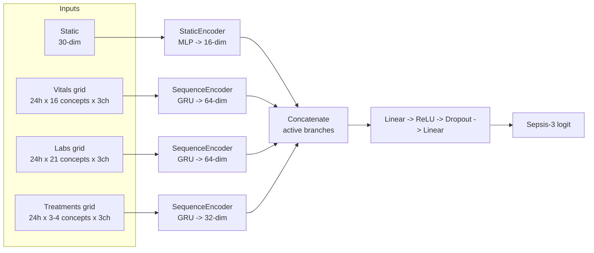

# Deep Learning (GRU/LSTM Intermediate Fusion) Experiment Layer

This folder implements the DL counterpart to the classical baselines in
`multi_modality_code/experiments/run_experiments.py`: per-modality recurrent
encoders (GRU by default, LSTM via `--cell_type`) fused at the representation
level, evaluated on the identical 8-ablation matrix, identical
`subject_id`-grouped splits, and identical threshold-tuning/evaluation
protocol as the classical ML baselines.

**Status: executed.** The full 8-ablation x 3-seed run lives in
`data/05_results/deep_learning/` (see [Results](#results)); the smoke test in
`data/05_results/deep_learning_smoke/`. Both were run on the post-regeneration
cohort (offset-matched controls, 9,278 stays), so their numbers are directly
comparable with `data/05_results/metrics.csv`.

## Input representation: hourly grid

Reuses `data/04_multimodal[_abx]/{static,vitals_timeseries,labs_timeseries,treatments_timeseries}.csv`
unchanged — no new feature extraction. Each stay becomes a set of dense
tensors over 24 hourly bins covering `[prediction_time - 24h, prediction_time)`.
Bin `b` (`0..23`) holds events with `hours_before_prediction ∈ [b, b+1)`;
`b=0` is the hour closest to `prediction_time`, `b=23` is the oldest hour.
Tensors are stored and fed to the encoders in **chronological order**
(oldest → newest, i.e. bin 23 first, bin 0 last).

| Concept class | Concepts | `value` | `mask` | `delta` | Normalization |
|---|---|---|---|---|---|
| Point-in-time / physiological state | all 16 vitals, all 21 labs, `vasopressor_rate` | mean of readings in bin; forward-filled from the nearest earlier bin if empty; train-mean (→0) if never observed in the window | 1 only for real (non-filled) observations | hours since last real observation, capped at 24 | z-score on the filled value using **train-split-only** per-concept mean/std; `delta` divided by 24 |
| Cumulative / rate treatment amount | `iv_fluid`, `urine_output`, `antibiotic_active` (abx export only) | sum of amounts ending in that bin; **no** forward-fill, empty bin = 0 | 1 if ≥1 event landed in the bin | hours since last bin with `mask=1`, capped at 24 | `log1p` then z-score (train-split stats); `delta` divided by 24 |

Per-timestep channel widths: vitals `16×3=48`, labs `21×3=63`, treatments
`3×3=9` (primary) / `4×3=12` (antibiotics sensitivity), static `12`
(no time dimension — reuses `build_static_matrix()` plus the same
train-fitted `drop_zero_variance()` filter as the classical baselines, so both
model families see an identical static feature set; the raw 13 columns lose one
constant). Static columns are additionally z-scored with train-split-only
means/stds and NaN-filled with the train mean.

Implemented in `grid_data.py`, which validates on every call that: no NaNs
remain in any `value` channel, `mask ∈ {0,1}`, `delta ∈ [0,1]` (post
`/24`), every tensor has exactly 24 timesteps, no row has
`hours_before_prediction < 0` (leakage), and normalization statistics are
computed only from the stay_ids passed in as `train_stay_ids`. Cached grid
tensors + normalization stats land under `<output_dir>/features/`.

## Architecture: per-modality intermediate fusion



Each modality has its own encoder with independent weights (`models.py`);
only the ablation's active branches are constructed, and their output
vectors are concatenated before the shared classifier head. `SequenceEncoder`
is the only module aware of recurrent-cell internals, so a future
`GRUDEncoder` or `TFTEncoder` can be substituted without touching
`FusionClassifier` or `run_dl_experiments.py`.

| Hyperparameter | Value |
|---|---|
| Cell type | GRU (default), LSTM via `--cell_type lstm` |
| Static encoder | `12 -> 32 -> 16` (ReLU, dropout 0.3) |
| Vitals/labs encoder | 1-layer GRU, hidden 64, projected to 64 |
| Treatments encoder | 1-layer GRU, hidden 32, projected to 32 |
| Classifier head | `concat -> 64 -> ReLU -> Dropout(0.3) -> 1` |
| Optimizer | Adam, `lr=1e-3`, `weight_decay=1e-4`, grad-clip norm 5.0 |
| Loss | `BCEWithLogitsLoss` (`--pos_weight` override, default 1.0) |
| Batch size | 128 |
| Early stopping | patience 10 on validation AUPRC, max 100 epochs, best-epoch weights restored |
| Threshold | tuned on validation, `--threshold_method youden` (default); F1 available as the secondary analysis |
| Device | `--device {auto,mps,cpu}`; `auto` (default) picks `mps` when available. Resolved device logged in `dl_manifest.json`. MPS and CPU are equally fast here (the model is tiny) but give slightly different numbers, so the reported run fixes one: `mps` |
| Seeds | `--seeds 42,43,44` (default); trained independently per seed, mean±std reported. `set_seed()` runs **before** each model is constructed — see [Reproducibility](#reproducibility) |

## Code layout

```
multi_modality_code/experiments/dl/
    grid_data.py         # hourly-grid tensor builder + caching + assertions (A1)
    datasets.py           # AblationGridDataset: torch Dataset keyed by active branches
    models.py              # StaticEncoder, SequenceEncoder, FusionClassifier (A2)
    train.py               # training loop, early stopping, seeding, device selection (A4)
    run_dl_experiments.py  # CLI entry point: loops the 8 ablations, writes outputs
```

## Commands

These are the exact commands that produced the artifacts in
`data/05_results/deep_learning[_smoke]/`.

```bash
# 1. Smoke test (fast correctness check on a small, label-balanced subset, run first)
uv run python -m multi_modality_code.experiments.dl.run_dl_experiments \
  --multimodal_dir data/04_multimodal \
  --abx_dir data/04_multimodal_abx \
  --output_dir data/05_results/deep_learning_smoke \
  --max_stays 200 \
  --seeds 42 \
  --cell_type gru \
  --max_epochs 20 \
  --threshold_method youden \
  --mimic_version "MIMIC-IV v3.1"

# 2. Full run (all 8 ablations, full cohort, multi-seed — the actual training phase)
uv run python -m multi_modality_code.experiments.dl.run_dl_experiments \
  --multimodal_dir data/04_multimodal \
  --abx_dir data/04_multimodal_abx \
  --output_dir data/05_results/deep_learning \
  --seeds 42,43,44 \
  --cell_type gru \
  --max_epochs 100 \
  --patience 10 \
  --batch_size 128 \
  --lr 1e-3 \
  --threshold_method youden \
  --mimic_version "MIMIC-IV v3.1"
```

Measured runtime on a local Apple M4 (16 GB RAM, MPS): **6 min 21 s** for all
8 ablations x 3 seeds = 24 trainings, of which ~35 s is building the two grid
tensor caches from the Stage-4 CSVs (cached afterwards). The smoke test takes
12 s. No cloud GPU needed — the train split is 6,494 stays and the largest model
is 72,497 parameters. Early stopping fired between epoch 16 and 63 (patience 10,
cap 100), so the epoch budget was never the binding constraint.

## Outputs

Written under `<output_dir>/` (a dedicated subfolder — never
`data/05_results/metrics.csv`, so the classical ML results are untouched):

- `dl_metrics.csv` — one row per ablation (the median-seed run's full metric
  suite, plus `cell_type`, `hidden_dims`, `n_params`, `n_epochs_trained`,
  `device`, `seeds`, `auroc_mean`/`auroc_std`, `auprc_mean`/`auprc_std`)
- `dl_manifest.json` — run metadata (seeds, device, hyperparameters, paths)
- The row also carries `median_seed`, naming which seed produced the reported
  operating point, so `experiments/posthoc_analysis.py` pairs the right
  prediction dump when it tests this arm against the classical models.
- `calibration/*.png` — one calibration curve per ablation (median-seed run)
- `features/*.npz` + `features/*_norm_stats.json` — cached grid tensors and
  their train-split normalization statistics

## Results

Test-split AUROC, median-seed run (the row written to `dl_metrics.csv`) with its
1000-resample bootstrap 95% CI, next to the mean±std across seeds 42/43/44 and
the best classical model on the same ablation from `data/05_results/metrics.csv`:

| Ablation | GRU AUROC [95% CI] | GRU mean±std | Best classical | Δ | paired p |
|---|---|---|---|---|---|
| `static_only` | 0.617 [0.589, 0.647] | 0.618 ± 0.001 | 0.627 (HistGBT) | −0.010 | 0.43 |
| `vitals_only` | 0.648 [0.620, 0.676] | 0.640 ± 0.007 | 0.660 (HistGBT) | −0.013 | 0.44 |
| `labs_only` | 0.599 [0.568, 0.629] | 0.596 ± 0.003 | 0.590 (XGBoost) | **+0.009** | 0.60 |
| `treatments_no_antibiotics` | 0.584 [0.554, 0.614] | 0.583 ± 0.001 | 0.610 (XGBoost, tied with HistGBT) | −0.025 | 0.10 |
| `vitals_plus_labs` | 0.669 [0.639, 0.694] | 0.663 ± 0.004 | 0.677 (XGBoost) | −0.008 | 0.57 |
| `static_plus_vitals_plus_labs` | 0.691 [0.664, 0.719] | 0.690 ± 0.003 | 0.709 (XGBoost) | −0.018 | 0.18 |
| `static_plus_vitals_plus_labs_plus_treatments` (primary) | 0.697 [0.672, 0.724] | 0.698 ± 0.001 | 0.721 (HistGBT) | −0.024 | 0.077 |
| `sensitivity_with_antibiotics` | 0.743 [0.719, 0.768] | 0.743 ± 0.002 | 0.781 (HistGBT) | **−0.039** | **<0.001** |

(Post-Charlson numbers: the static block now carries the Charlson index and its 17
category flags, so every ablation touching `static` moved. `paired p` is the
bootstrap paired test against the best classical model on the same test patients,
from `data/05_results/paired_tests.csv`.)

Reading of these numbers:

- **The GRU does not beat the gradient-boosted trees.** It trails on seven of eight
  ablations. The paired test — which is more sensitive than comparing overlapping
  marginal CIs, because both models score the same patients — finds the gap
  significant only on the antibiotics ablation (−0.039, p < 0.001); on the primary
  ablation p = 0.077. With 6,494 training stays, one prediction per stay and a
  24-hour window, this is the expected outcome for a recurrent model against
  boosted trees on tabular aggregates; it is a finding to report, not a bug to fix.
- **It does beat logistic regression**, though: +0.041 [+0.014, +0.067], p = 0.001
  on the primary ablation, and significantly on 5 of the 8 ablations. So the
  recurrent model is learning something the linear model cannot — it just does not
  reach the trees.
- **The multimodal ordering is reproduced independently.** Adding modalities helps
  the DL model the same way it helps the trees (0.58–0.65 unimodal → 0.70
  multimodal), and antibiotics still buy the same ~0.05 AUROC, so the leakage
  demonstration holds under a second model family.
- **Seed sensitivity is small**: std ≤ 0.007 AUROC across three seeds, an order of
  magnitude below the modality effects being discussed.
- **The operating point uses Youden's J, not F1.** At the cohort's 50 % prevalence a
  trivial all-positive rule already scores F1 = 0.667, so maximising F1 collapses the
  weaker ablations onto it: 85 of the 117 runs (both arms, all seeds) land within 0.02
  of the trivial rule. Youden (`sens + spec - 1`) is the default in both arms — mean
  specificity 0.616 instead of 0.199, and 21 of 117 near-degenerate.
  AUROC/AUPRC and the CIs are threshold-free and identical under either criterion; both are
  tabulated per run in `data/05_results/threshold_comparison.csv`
  (`experiments/threshold_report.py`).
- **PPV is reported at ICU-realistic prevalence too.** On the primary ablation the GRU's
  PPV is 0.685 at this cohort's 50 % prevalence and 0.103 at 5 % — the `ppv_at_5pct_prevalence`
  column exists so that difference cannot be read past.

## Reproducibility

`--seeds` now controls the whole run, which it previously did not: the encoders
were constructed in `run_one_ablation()` *before* `train_model()` called
`set_seed()`, and torch seeds its default generator from OS entropy at first use,
so **weight initialisation was unseeded**. Same-seed repeats of the smoke matrix
differed by up to 0.18 AUROC, on CPU as well as MPS, and the multi-seed spread
mixed genuine seed sensitivity with uncontrolled init noise. `set_seed()` is now
called before each model is built, and it also seeds the MPS generator
(`torch.mps.manual_seed`), which is separate from the CPU one.

With that fix, repeating a run with the same seeds and device reproduces
`dl_metrics.csv` **bit-identically** — verified on both `mps` and `cpu`, at smoke
scale and at full cohort scale. Numbers do differ between devices (same seed,
`|Δ AUROC|` up to ~0.2 at smoke scale), so the device is pinned and recorded in
`dl_manifest.json` alongside the resolved library versions.

## Notes / deferred items

- Bootstrap 95 % CIs are computed and present in `dl_metrics.csv`
  (`auroc_ci_low/high`, `auprc_ci_low/high`), using the same
  `evaluate.bootstrap_ci()` helper as the classical pipeline.
- Permutation feature importance is in `dl_feature_importance.csv`, the DL
  counterpart to the classical `feature_importance.csv`: same score (test
  AUPRC), same `n_repeats=20`, same primary-ablation scope, computed on the
  median-seed model without retraining it. The unit that gets permuted is not a
  matrix column — this arm has no matrix — but a whole clinical concept: its
  `value`/`mask`/`delta` channels move to another stay together across all 24
  hours, so the trajectory stays intact and only the concept-to-patient link
  breaks. Static features are permuted column by column as in the classical arm.
  Rows are named `<concept>__seq` for sequence concepts and by column name for
  static ones. `--permutation_repeats 0` skips the analysis; see
  `dl/importance.py` and `tests/test_dl_importance.py`.
- `--max_stays` mirrors `4_build_multimodal_dataset.py`'s smoke-test convention
  (label-balanced subset) and is meant only for the correctness pass above,
  not for reporting real numbers.
- MPS turned out to be reproducible here once seeding was fixed (see
  [Reproducibility](#reproducibility)); the earlier suspicion that Apple-GPU
  non-determinism drove run-to-run variance was wrong — unseeded weight init was.
  Regenerating on a different device or seed set still changes the numbers, so
  keep `device` and `seeds` from `dl_manifest.json` in any write-up.
- **Three ablations of the classical arm are not mirrored here.**
  `clinical_scores_only`, `primary_no_temporal_position` and
  `primary_no_billing_features` are flagged `classical_only` in
  `ablation_configs()`: this arm resolves branch widths through
  `GridBundle.branch_input_dim()`, which has no clinical-score branch and does not
  know about `drop_features`. They are skipped with a log line naming them, so
  `dl_metrics.csv` stays at 8 rows while `metrics.csv` has more. The ML-vs-DL
  comparison is therefore restricted to the 8 shared ablations, which is what the
  memoir should say.
- Text/ClinicalBERT, GRU-D, TFT, and cross-attention/late fusion remain future
  work — see `multi_modality_code/experiments/README.md` and Ch. 8 of the thesis.
